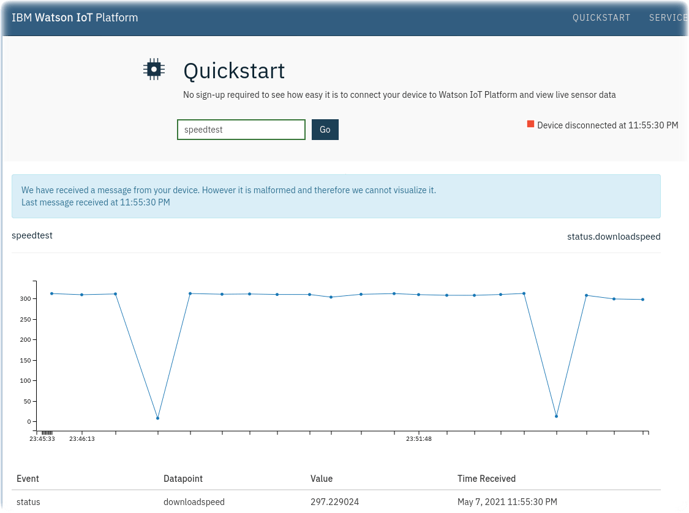

# IBM Edge Application Manager Speedtest to Watson IoT Platform Quickstart

This repository builds a Docker containerized workload that can be deployed to
an edge node running the Open Horizon agent. The workload can be configured as
a managed service and pattern in IBM Edge Application Manager.  It runs
Speedtest periodically and sends the download bandwidth results over MQTT to
Watson IoT Platform Quickstart and plots the results in a chart.



### Prerequistes

- Docker installed
- IEAM Horizon agent installed
- [Speedtest CLI](https://www.speedtest.net/apps/cli)

###

Begin by editing the variables at the top of the Makefile as desired. If you plan to push it to a Docker registery, make sure you give your docker ID. You may also want to create unique names for your **service** and **pattern** (necessary if you are sharing a tenancy with other users and you are all publishing this service).

To play with this outside of Open Horizon:

```
make build
make run
...
make test
make stop
```

When you are ready to try it inside Open Horizon:

```
docker login
make build
make push
make publish-service
make publish-patterrn
```

Once it is published, you can use:

```
make register-pattern
watch hzn agreement list
...
make test
```

### Other resources

There are original implementations of this Speedtest idea in the Open Horizon
examples repository.  This variant is somewhat simpler.

- [Horizon Speedtest REST Service](https://github.com/open-horizon/examples/tree/master/edge/services/speedtest)
